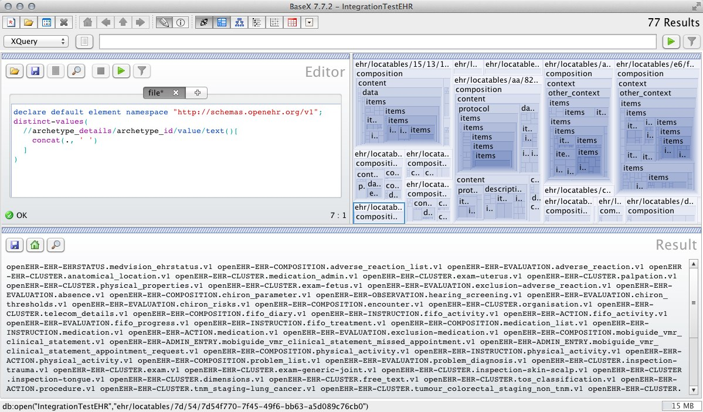

MEDrecord Java Code
===================
This is the implementation of MEDrecord and its tools. See http://medrecord.medvision360.org/ for more information.

Online demo
-----------
Visit

    http://medrecord.test.medvision360.org/medrecord/

for a live demo version of medrecord. Feel free to experiment with this installation: that's what it's for!

License
=======
This work is licensed under a Creative Commons Attribution-NonCommercial-ShareAlike 4.0 International License (the 
"License"); you may not use this file except in compliance with the License. You may obtain a copy of the License at

    http://creativecommons.org/licenses/by-nc-sa/4.0/

Why creative commons?
---------------------
We want a well-recognized, simple to understand, internationally validated license that simply, freely and safely
allows academic research and standards compatibility testing, while not allowing commercial use of any kind. 
Though creative commons licenses are not ideal for software, there is unfortunately no open source license or open 
source licensing model that satisfies our needs.

Contact us if you're interested in commercial use of medrecord.

Building and running
====================
MEDrecord is built with gradle. It makes use of some custom MEDvision build plugins and library dependencies that you
 can find at http://repo.medvision360.org/ .

Submodules
----------
If you cloned this repository like so:

    git clone https://github.com/MEDvision/medrecord.git --recursive

You probably know all about submodules. Skip this section.

Medstrap uses [git submodules](http://git-scm.com/book/en/Git-Tools-Submodules). Because the only way we distribute 
medstrap is by letting you clone the git repository, if you use medstrap, you need to use git submodules, too. Git
submodules are powerful, but, if you have not seem them before, they may require some study. They also have some
quirks in old versions of the git client.

By invoking the right git commands, git will recursively clone all the submodules. You can use

    git clone https://github.com/MEDvision/medrecord.git --recursive

or you can use

    git clone git@github.com:MEDvision/medrecord.git
    git submodule update --init --recursive

they mean the same thing. When you are pulling in new code from remote sources like github, you should use

    git pull
    git submodule update --recursive

to also get new code for the submodules.

Quickstart
----------
- install the latest stable version of
  [JDK 7](http://www.oracle.com/technetwork/java/javase/downloads/jdk7-downloads-1880260.html).

- install the latest stable version of [gradle](http://www.gradle.org/). Make sure gradle is using JDK 7.
  The easiest way to do that is to point JAVA_HOME to JDK 7, and add its /bin directory to your PATH.

- build our version of the openehr reference implementation

        gradle vendor
  
  you don't need to do this every time you build; only if a 'git submodule update' indicated there's
  changes to the reference implementation.

- build medrecord itself:

        gradle install

- if you are on an ubuntu machine, you can build the debian package:

        cd medrecord-server/medrecord-server-deb
        gradle buildDebianPackage

- you can run the unit tests and integration tests:

        gradle test integrationTest

Run the server
--------------
        gradle tomcatRunWar

Now point your browser to http://localhost:8100/medrecord . Of particular interest should be the interactive API docs
for the /v2 API at http://localhost:8100/medrecord/v2/apidocs/ which should look something like
 

Generate IDEA project files
---------------------------

- run: `gradle idea`
- remove them: `gradle cleanIdea`

Using the BaseX GUI
-------------------
If you have run the integration tests, your local BaseX database repository will contain a lot of generated 
example data. It's interesting to download the
[BaseX GUI](http://basex.org/products/gui/) to look at and experiment with the underlying XML storage:

