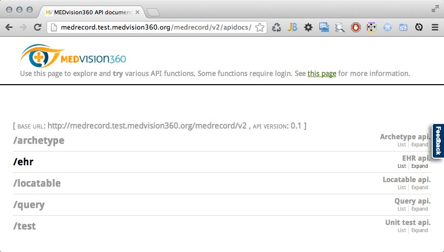
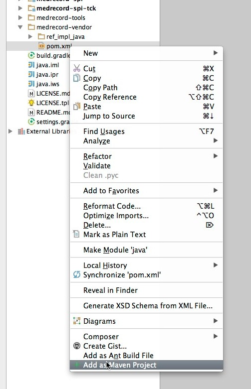
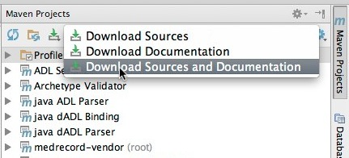

MEDrecord Java Code
===================
This is the implementation of MEDrecord and its tools. See http://medrecord.medvision360.org/ for more information.

Online demo
-----------
Visit

* http://medrecord.test.medvision360.org/medrecord/

for a live demo version of medrecord. Feel free to experiment with this installation: that's what it's for!

License
=======
This work is licensed under a Creative Commons Attribution-NonCommercial-ShareAlike 4.0 International License (the 
"License"); you may not use this file except in compliance with the License. You may obtain a copy of the License at

* http://creativecommons.org/licenses/by-nc-sa/4.0/

Why creative commons?
---------------------
We want a well-recognized, simple to understand, internationally validated license that simply, freely and safely
allows academic research and standards compatibility testing, while not allowing commercial use of any kind. 
Though creative commons licenses are not ideal for software, there is unfortunately no open source license or open 
source licensing model that satisfies our needs.

Contact us if you're interested in commercial use of medrecord.

Building and running
====================
MEDrecord is built with gradle. It makes use of some custom MEDvision build plugins and library dependencies that you
 can find at http://repo.medvision360.org/ .

Submodules
----------
If you cloned this repository like so:

    git clone https://github.com/MEDvision/medrecord.git --recursive

You probably know all about submodules. Skip this section.

Medrecord uses [git submodules](http://git-scm.com/book/en/Git-Tools-Submodules). Because the only way we distribute 
medrecord is by letting you clone the git repository, if you use medrecord, you need to use git submodules, too. Git
submodules are powerful, but, if you have not seem them before, they may require some study. They also have some
quirks in old versions of the git client.

By invoking the right git commands, git will recursively clone all the submodules. You can use

    git clone https://github.com/MEDvision/medrecord.git --recursive

or you can use

    git clone git@github.com:MEDvision/medrecord.git
    git submodule update --init --recursive

they mean the same thing. When you are pulling in new code from remote sources like github, you should use

    git pull
    git submodule update --recursive

to also get new code for the submodules.

Prerequisites
-------------
- install the latest stable version of
  [JDK 7](http://www.oracle.com/technetwork/java/javase/downloads/jdk7-downloads-1880260.html).

- install the latest stable version of [gradle](http://www.gradle.org/). Make sure gradle is using JDK 7.
  The easiest way to do that is to point `JAVA_HOME` to JDK 7, and add its `/bin` directory to your `PATH`.

Building with gradle
--------------------
- build our version of the openehr reference implementation

        gradle vendor
  
  you don't need to do this every time you build; only if a `git submodule update` indicated there's
  changes to the reference implementation.

- build medrecord itself:

        gradle install

- if you are on an ubuntu machine, you can build the debian package:

        cd medrecord-server/medrecord-server-deb
        gradle buildDebianPackage

- you can run the unit tests and integration tests:

        gradle test integrationTest

Run the server
--------------
        gradle tomcatRunWar

Now point your browser to http://localhost:8100/medrecord . Of particular interest should be the interactive API docs
for the `/v2` API at http://localhost:8100/medrecord/v2/apidocs/ which should look something like
 

The `/v1` API (called the `middleware` in some places) is for backward compatibility with an earlier MEDvision360 
product and is not likely to be of much interest to most users.

Generate IDEA project files
---------------------------
At MEDvision, we are using IntelliJ to develop medrecord. Gradle can be used to generate an IntelliJ project for you:

- run: `gradle idea`
- open the generated `java.ipr` with IntelliJ
- navigate to `medrecord-vendor/pom.xml` in the project explorer and add it as a maven project:
  
- if you don't have IntelliJ configured to do this automatically, download sources and docs for the maven dependencies:
  

Using the BaseX GUI
-------------------
If you have run the integration tests, your local BaseX database repository will contain a lot of generated 
example data. It's interesting to download the
[BaseX GUI](http://basex.org/products/gui/) to look at and experiment with the underlying XML storage:

Installing the server
---------------------
You need a unix server with java 7 and tomcat 7.0.34 or later. For a server running ubuntu linux 12.04 LTS (and
probably many other ubuntu variants), you can ensure this with

    sudo add-apt-repository ppa:dirk-computer42/c42-backport
    apt-get install openjdk-7-jre-headless tomcat7

You also need several configuration files under `/etc/medvision360/medrecord`. Read or run
[medrecord-server/deploy.sh](medrecord-server/deploy.sh) for the easiest way to write those.

Third, you need a place for medrecord to write its log files. The logback config suggested by deploy.sh logs to
`/var/log/medvision360/medrecord`. Our debian package creates that directory automatically, but if you are not
installing with the debian package, you need to create it yourself:

    mkdir -p /var/log/medvision360/medrecord
    chown tomcat7:tomcat7 /var/log/medvision360/medrecord
    chmod 700 /var/log/medvision360/medrecord

Finally, you need a place for BaseX to write its files. If you use the default config, that will be `/var/lib/basex`,
which needs to be readable and writeable by tomcat. Again, on ubuntu 12.04 LTS, deploy.sh shows you the way:

    mkdir -p /var/lib/basex
    chown tomcat7:tomcat7 /var/lib/basex
    chmod 700 /var/lib/basex

You are now ready to install medrecord itself. This simply involves copying `medrecord.war` into the tomcat webapp
directory, `/var/lib/tomcat7/webapps` on Ubuntu Linux. If you are installing on ubuntu linux, you may wish to use the
debian package built with
[medrecord-server/medrecord-server-deb](medrecord-server/medrecord-server-deb):

    dpkg -i mv-medrecord-*.deb

Otherwise, just copy the `medrecord.war` generated by
[medrecord-server/medrecord-server-server](medrecord-server/medrecord-server-server).

If all went well, this should result in medrecord being available on port 8080 at `/medrecord`.

Securing the server
-------------------
Providing a secure hosting environment for medical information is no simple task and describing how to do it is
far beyond the scope of this README. However, here's a few pointers:

- The provided logback configuration does a lot of logging. For a production deployment, especially one that will
  contain actual patient data, you will have to tune this logging configuration in accordance with your privacy and
  audit requirements. It may be a good idea to disable it completely.

- The provided logback configuration uses a MEDvision library called wslog to log on a WebSocket. This is great for
  debugging, but you should disable this functionality for production use.

- You will obviously need to secure and lock down your tomcat. MEDvision runs tomcat proxied behind apache, accepting
  connections from apache only if apache is using a recognized SSL client certificate. Apache in turns is also
  configured to use SSL only and require SSL client certificates in order to connect. Audit logs are kept noting the
  SSL client certificates used for each request. We recommend you take similar measures.

- The data persisted by BaseX is not encrypted or otherwise secured. You should secure the data in accordance with
  your requirements, such as making `/var` an encrypted partition. We also recommend you study the workings of BaseX
  itself to determine what backup strategy may be acceptable to you.
